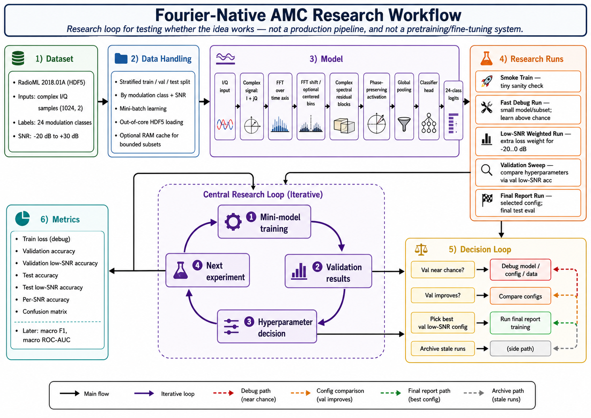

# Fourier-Native RadioML AMC

This project implements a Fourier-native, phase-preserving baseline for automatic
modulation classification on RadioML 2018.01A.

The model takes complex I/Q samples, applies an FFT inside the network, and then
uses complex-valued spectral residual blocks before classification. The training
script reports both full-range accuracy and the low-SNR metrics needed for the
proposal: `-20..0 dB`, per-SNR accuracy, and confusion matrices.

## Expected Dataset

Download RadioML 2018.01A separately and point the scripts at the HDF5 file. The
loader expects the common DeepSig-style keys:

- `X`: examples shaped `(N, 1024, 2)` or `(N, 2, 1024)`
- `Y`: one-hot labels shaped `(N, 24)` or integer labels shaped `(N,)`
- `Z`: SNR values shaped `(N, 1)` or `(N,)`

The dataset is intentionally not committed to this repo.

One convenient source is Kaggle:

```python
import kagglehub

path = kagglehub.dataset_download("pinxau1000/radioml2018")
print("Path to dataset files:", path)
```

Then pass the downloaded `.hdf5` file to the training script.

## Setup

```bash
python -m venv .venv
source .venv/bin/activate
pip install -r requirements.txt
```

## Train Workflow

Recommended backend on Apple Silicon:

```bash
python scripts/train_fourier_amc_mlx.py \
  --data /path/to/GOLD_XYZ_OSC.0001_1024.hdf5 \
  --epochs 40 \
  --batch-size 512 \
  --device auto \
  --output-dir runs/fourier_complex_mlx/final_report
```

The MLX path uses Apple Metal through MLX when available and is the preferred
backend for Apple Silicon Macs.

PyTorch fallback:

```bash
python scripts/train_fourier_amc.py \
  --data /path/to/GOLD_XYZ_OSC.0001_1024.hdf5 \
  --epochs 40 \
  --batch-size 512 \
  --device auto \
  --output-dir runs/fourier_complex
```

On Apple Silicon, the PyTorch `--device auto` uses MPS when PyTorch reports that MPS is
available. You can force it with `--device mps`; if PyTorch cannot create an MPS
tensor, the script raises the original backend error.

For a quick smoke test:

```bash
python scripts/train_fourier_amc_mlx.py \
  --data /path/to/GOLD_XYZ_OSC.0001_1024.hdf5 \
  --epochs 1 \
  --max-train 4096 \
  --max-val 1024 \
  --max-test 1024 \
  --cache-data ram \
  --output-dir runs/fourier_complex_mlx/smoke
```

For a fast debug run that checks whether validation rises above chance:

```bash
python scripts/train_fourier_amc_mlx.py \
  --data /path/to/GOLD_XYZ_OSC.0001_1024.hdf5 \
  --epochs 8 \
  --batch-size 512 \
  --width 32 \
  --depth 4 \
  --keep-bins 512 \
  --max-train 102400 \
  --max-val 20480 \
  --max-test 20480 \
  --steps-per-epoch 200 \
  --val-steps 40 \
  --cache-data ram \
  --output-dir runs/fourier_complex_mlx/debug_fast
```

To test the low-SNR weighted objective, repeat the debug run with:

```bash
--low-snr-loss-weight 2.0 \
--output-dir runs/fourier_complex_mlx/debug_low_snr_weighted
```

Remove `--steps-per-epoch` and `--val-steps` for final benchmark runs.
By default the MLX trainer records train loss only; add `--train-metrics full`
when you need training accuracy, at the cost of an extra forward pass.
Use `--cache-data ram` only with bounded subsets unless you intentionally want
to keep many gigabytes of I/Q samples in memory.

## Validation Sweep

Use the validation set to tune hyperparameters without repeatedly scoring the
test set. You can run one trial at a time across multiple days:

```bash
python scripts/sweep_fourier_amc_mlx.py \
  --data /path/to/GOLD_XYZ_OSC.0001_1024.hdf5 \
  --epochs 1 \
  --batch-size 512 \
  --device auto \
  --max-train 102400 \
  --max-val 20480 \
  --cache-data ram \
  --skip-completed \
  --trial baseline \
  --output-dir runs/fourier_complex_mlx/sweep
```

Available trial names are `baseline`, `small`, `low_snr_weighted`,
`center_bins_512`, and `wider`. Re-run the command with a different `--trial`
when you have time. To rebuild the summary from already completed trial
folders, run:

```bash
python scripts/sweep_fourier_amc_mlx.py \
  --data /path/to/GOLD_XYZ_OSC.0001_1024.hdf5 \
  --summary-only \
  --output-dir runs/fourier_complex_mlx/sweep
```

The sweep ranks trials by validation accuracy over `-20..0 dB` and writes:

- `sweep_results.csv`: validation ranking across trials
- `split.npz`: one shared train/validation/test split reused by every trial
- one run directory per trial with `best.safetensors` and `metrics.json`

After choosing a config, run one final training job in
`runs/fourier_complex_mlx/final_report` with `--train-metrics full` and without
`--skip-test`, then report the final test numbers from that run.

## Current Progress and Plan

These are early research/prototype runs, not final benchmark claims. They use
bounded subsets and capped validation to confirm the method learns and to guide
which configurations deserve longer runs.



Chance accuracy for 24 classes is about `0.0417`.

| Run | Purpose | Config summary | Best/observed result | Status |
|---|---|---|---|---|
| `smoke` | Sanity-check data, model, MLX training, and metric plumbing | 4,096 train / 1,024 val / 1,024 test, 1 epoch | `val_acc=0.0498`, `val_low_snr=0.0400`, `test_acc=0.0557`, `test_low_snr=0.0477` | Passed pipeline check only |
| `debug_fast` | Fast unweighted learning check | `width=32`, `depth=4`, `keep_bins=512`, 102,400 train / 20,480 val, 200 train steps, 40 val steps | Best seen: `val_acc=0.2017`, `val_low_snr=0.1151` at epoch 3 | Learns above chance; current best debug signal |
| `debug_low_snr_weighted` | Test naive low-SNR weighted loss | Same as `debug_fast` plus `low_snr_loss_weight=2.0` | Best seen: `val_acc=0.1953`, `val_low_snr=0.1050`; final subset test `test_acc=0.1845`, `test_low_snr=0.0983` | Learned, but did not beat unweighted debug run |
| `sweep/baseline` | First resumable validation-sweep trial | See `scripts/sweep_fourier_amc_mlx.py` trial config | In progress / run one trial at a time | Use cumulative sweep summary |

### Current Interpretation

- The implementation is learning above chance on `debug_fast`.
- Naive `low_snr_loss_weight=2.0` has not helped yet.
- The mini-runs are proxy experiments. Final claims still require serious
  validation runs and one held-out test evaluation.
- Next step: continue the resumable validation sweep one trial at a time, then
  run `final_report` with `--train-metrics full` on the selected config.

### What Is Already Implemented

- MLX/Metal training path for Apple Silicon.
- PyTorch fallback training path.
- Fourier-native complex spectral model.
- Stratified train/validation/test split by modulation class and SNR.
- Out-of-core HDF5 mini-batch loading.
- Optional RAM caching for bounded subsets.
- Low-SNR validation metric over `-20..0 dB`.
- Best-checkpoint saving by validation low-SNR accuracy.
- Latest-checkpoint saving after completed epochs.
- Graceful interrupted-run metadata through `metrics_partial.json`.
- Resumable one-trial-at-a-time validation sweep.
- Active run-folder structure plus archive folder for stale experiments.

### Planned Research Steps

1. Complete the one-trial-at-a-time validation sweep:
   - `baseline`
   - `small`
   - `low_snr_weighted`
   - `center_bins_512`
   - `wider`

2. Pick 2-3 promising configs from `sweep_results.csv`.

3. Run serious validation jobs:
   - larger/full model where feasible
   - more epochs
   - full or less-capped validation
   - same fixed split across configs

4. Select the final config using validation low-SNR accuracy, while checking
   overall validation accuracy to avoid over-specializing.

5. Run one final held-out test evaluation in `final_report` with
   `--train-metrics full`.

6. Report final metrics:
   - train accuracy
   - validation accuracy
   - validation low-SNR accuracy
   - test accuracy
   - test low-SNR accuracy
   - per-SNR accuracy
   - confusion matrix
   - parameter count

### Planned Improvements

- Add macro F1 and macro one-vs-rest ROC-AUC for validation/test.
- Add checkpoint initialization or resume support for explicit
  pretrain/fine-tune experiments.
- Add baseline model scripts for fair comparison against time-domain models.
- Add a magnitude-only FFT ablation to separate phase preservation from
  frequency-domain representation.
- Add a real-valued FFT ablation to compare against the complex-valued backbone.
- Add timing/throughput reporting for training and inference.
- Add optional model compression experiments:
  - smaller width/depth variants
  - FFT bin truncation
  - later quantization/pruning if needed

### What This Is Not Yet

- Not a final benchmark result.
- Not a production ML pipeline.
- Not pretraining/fine-tuning yet.
- Not a deployment-ready compressed model yet.
- Not enough evidence yet to claim the Fourier-native method beats published
  baselines.

## Run Folders

Current active run folders:

- `runs/fourier_complex_mlx/smoke`: tiny environment and data sanity check
- `runs/fourier_complex_mlx/debug_fast`: quick unweighted learning check
- `runs/fourier_complex_mlx/debug_low_snr_weighted`: quick low-SNR weighted check
- `runs/fourier_complex_mlx/sweep`: validation-only hyperparameter sweep
- `runs/fourier_complex_mlx/final_report`: final report-quality run
- `runs/archive`: older or legacy runs not used by the current notebook flow

## Outputs

Each run writes:

- `best.safetensors`: best validation checkpoint for MLX runs
- `latest.safetensors`: latest completed epoch for MLX runs
- `metrics.json`: final train/validation/test metrics
- `metrics_partial.json`: completed-epoch history if a run is interrupted
- `per_snr_accuracy.csv`: test accuracy by SNR
- `confusion_matrix.npy`: full test confusion matrix
- `split.npz`: reproducible train/validation/test indices
